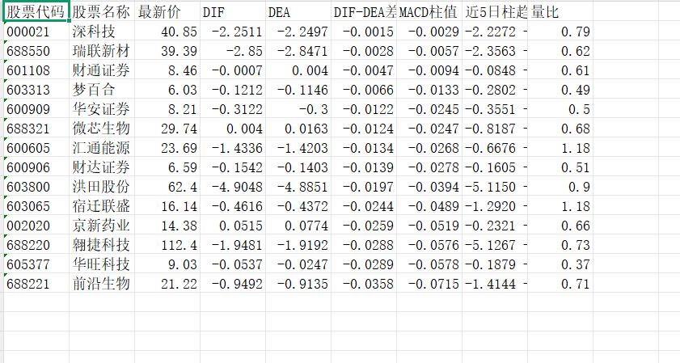
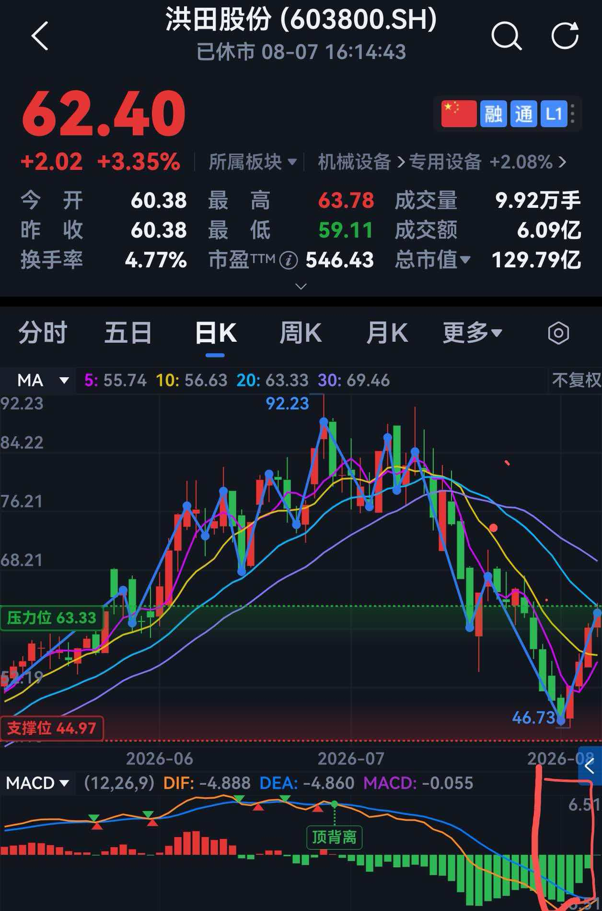
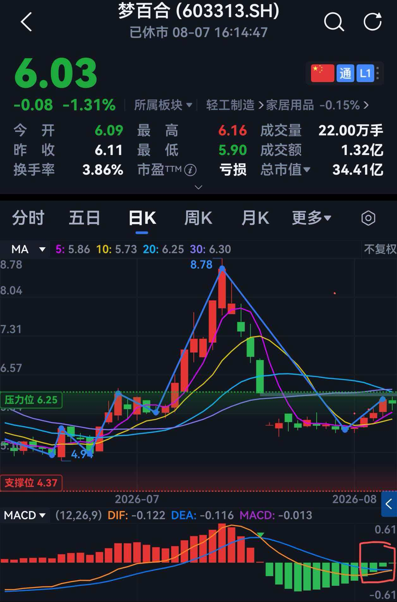
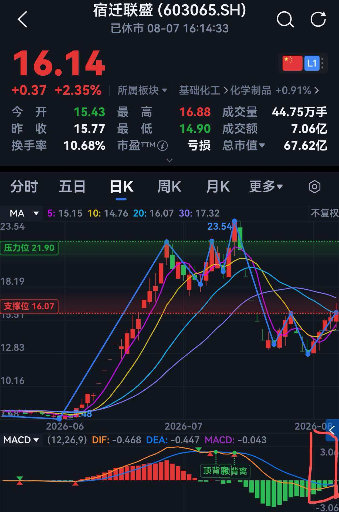
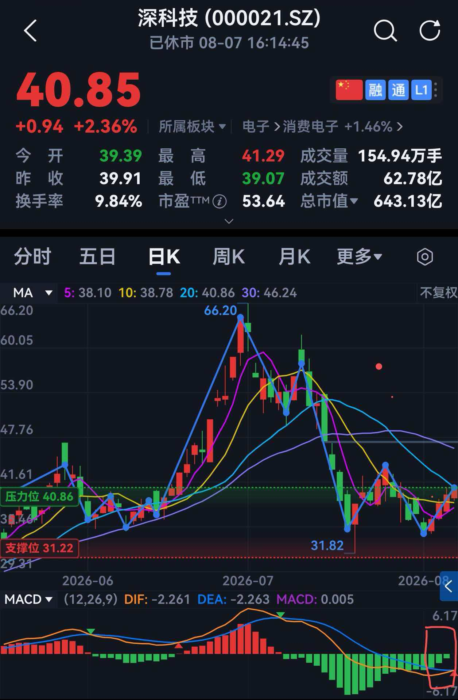

<div align="center">

# 📈 MACD-BottomScreener

**基于 MACD 绿柱动量衰减 + 低位金叉前夕的全 A 股抄底选股量化工具**

[](https://www.python.org/)
[](LICENSE)
[](http://baostock.com/)
[](#-效果展示)
[](https://peps.python.org/pep-0008/)

[项目简介](#-项目简介) • [核心特性](#-核心特性) • [策略逻辑](#-策略逻辑与选股模型) • [快速开始](#-快速开始) • [参数配置](#-核心参数配置) • [效果展示](#-效果展示)

</div>

---

## 📖 目录

- [💡 项目简介](#-项目简介)
- [🔥 核心特性](#-核心特性)
- [📐 策略逻辑与选股模型](#-策略逻辑与选股模型)
  - [1. MACD 指标计算公式](#1-macd-指标计算公式)
  - [2. 抄底筛选四重判定法则](#2-抄底筛选四重判定法则)
- [🚀 快速开始](#-快速开始)
  - [1. 环境准备](#1-环境准备)
  - [2. 克隆项目与安装依赖](#2-克隆项目与安装依赖)
  - [3. 运行选股程序](#3-运行选股程序)
  - [4. 单股调试（可选）](#4-单股调试可选)
- [⚙️ 核心参数配置](#-核心参数配置)
- [📊 效果展示](#-效果展示)
- [⚠️ 免责声明](#-免责声明)
- [🤝 贡献与支持](#-贡献与支持)

---

## 💡 项目简介

**MACD-BottomScreener** 是一款专为 A 股市场设计的**低位抄底量化选股工具**。

当标的经历深度回调后，传统趋势指标往往存在滞后性。本系统通过 **baostock** 数据源自动获取全市场日 K 线，多进程并发计算 MACD 指标，结合**绿柱连续缩小（空头动量衰减）**、**柱值逼近零轴**与**DIF-DEA 金叉前夕收敛**等多重因子，精准捕捉空头力量衰竭、底部拐点初显的标的，并自动导出结构化 Excel 报表供复盘决策。

---

## 🔥 核心特性

- **🔍 全市场自动化扫描**：覆盖沪深主板、科创板与创业板 5000+ 只股票，自动排除 ST/退市/新股。
- **🚀 多进程并发加速**：基于 `ProcessPoolExecutor` 的 8 进程并发拉取 K 线，全市场扫描约 5–7 分钟。
- **📐 动态 MACD 抄底算法**：
  - **绿柱动量衰减**：连续 5 日 MACD 绿柱逐日缩小，识别零轴下方空头动能衰竭拐点。
  - **柱值逼近零轴**：最新柱值 `|HIST| < 0.08`，锁定即将翻红的临界形态。
  - **金叉前夕**：DIF 从下方收敛于 DEA、差距逐日缩小，捕捉低位金叉前夜。
  - **量能验证**：引入近 5 日/前 20 日量比因子，过滤无量死寂股。
- **📁 结构化 Excel 自动导出**：生成包含现价、DIF、DEA、柱值、柱趋势与量比的 `.xlsx` 报表。
- **⚡ 稳定可靠的数据源**：原生集成 **baostock** 独立数据服务器，不受东方财富等平台反爬限制。

---

## 📐 策略逻辑与选股模型

### 1. MACD 指标计算公式

基础指数移动平均线 (EMA) 与 MACD 计算：

$$\text{EMA}_n = \text{EMA}(\text{Close}, n)$$

$$\text{DIF} = \text{EMA}_{12} - \text{EMA}_{26}$$

$$\text{DEA} = \text{EMA}(\text{DIF}, 9)$$

$$\text{MACD 柱值} = 2 \times (\text{DIF} - \text{DEA})$$

### 2. 抄底筛选四重判定法则
选股模型由四个关键条件同时约束，严格保证 **“位置低、空头弱、拐点近、即将反转”**。

#### 条件一：连续绿柱 · 低位确认
近 5 个交易日 MACD 柱全部为负值，确保个股处于持续回调后的低位空头区间，不追高位回落标的。

#### 条件二：空头衰竭 · 动能持续减弱
连续 5 个交易日 MACD 绿柱**越来越短**，柱值持续向上修复，代表市场抛压逐步耗尽，下跌动能枯竭。

#### 条件三：逼近零轴 · 拐点临界形态
最新 MACD 绿柱绝对值极小，收缩至 **0.08 临界值以内**，处于马上由绿翻红、多空切换的关键拐点位置。

#### 条件四：双线收敛 · 低位金叉前夜
DIF 持续处于 DEA 下方（保证绝对低位），且 DIF 与 DEA 的间距持续缩小，双线逐渐粘合蓄力，即将形成低位金叉反转。

> 同时满足以上四重条件，即为标准**空头衰竭、底部蓄力、即将反弹**的抄底形态。

---

## 🚀 快速开始

### 1. 环境准备

确保开发环境中已安装 **Python 3.8+**：

```bash
python --version
```

### 2. 克隆项目与安装依赖

```bash
# 克隆仓库
git clone https://github.com/mark32123/MACD-BottomScreener.git

# 进入项目目录
cd MACD-BottomScreener

# 安装依赖
pip install -r requirements.txt
```

`requirements.txt` 核心依赖：

```text
pandas>=1.5.0
numpy>=1.22.0
baostock>=0.8.9
openpyxl>=3.0.0
matplotlib>=3.5.0   # 单股调试画图用
```

### 3. 运行选股程序

```bash
python select_tool.py
```

扫描完成后，当前目录将生成 `MACD抄底选股_YYYYMMDD_HHMMSS.xlsx` 结果报表。

### 4. 单股调试（可选）

修改 `test.py` 中的 `TEST_CODE` / `TEST_MARKET` 后运行，可查看单只股票的 MACD 数据与走势图：

```bash
python test.py
```

## ⚙️ 核心参数配置

所有参数集中在 `select_tool.py` 文件顶部的"可调参数"区：

| 参数 | 默认值 | 说明 |
|------|:---:|------|
| `MACD_FAST` | `12` | MACD 快线 EMA 周期 |
| `MACD_SLOW` | `26` | MACD 慢线 EMA 周期 |
| `MACD_SIGNAL` | `9` | DEA 信号线周期 |
| `LOOKBACK_DAYS` | `5` | 绿柱缩小的观察天数 |
| `HIST_NEAR_ZERO` | `0.08` | 柱值逼近零轴的阈值（放宽可提高命中率） |
| `MIN_HISTORY_DAYS` | `60` | 计算 MACD 所需最少 K 线数量 |
| `PROCESS_WORKERS` | `8` | 并发进程数（视 CPU 核数调整） |

> 💡 **提示**：若扫描结果为空，可适当调大 `HIST_NEAR_ZERO`（如改为 `0.15`）放宽筛选条件。

## 📊 效果展示











---

## ⚠️ 免责声明

> [!WARNING]
> **免责声明 (Disclaimer)**
>
> 本项目仅供学术研究、量化技术交流及 Python 编程学习使用，**不构成任何投资建议、推荐或买卖依据**。
>
> 股市有风险，投资需谨慎。投资者据此策略及程序操作，风险自担。
>
> 作者及贡献者不对因使用本程序或数据造成的任何直接或间接投资损失承担法律责任。


## 🤝 贡献与支持

欢迎提交 Issue 或 Pull Request 来优化选股因子、提升数据效率或扩充策略功能！如果这个项目对你的量化研究有所帮助，欢迎点个 ⭐ Star 支持一下！

Made with ❤️ for Quant Traders & Developers

